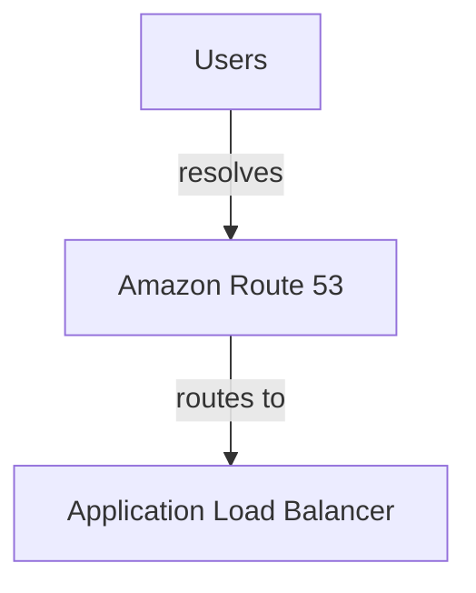

# CloudBridge IQ Project Documentation

AI Cloud Migration Assessment Platform

Version: 1.1
Prepared for: CloudBridge IQ project review
Repository: CloudBridge-IQ
Primary runtime: FastAPI, LangGraph, LangChain, Pydantic, OpenAI, ReportLab, Pillow
Last updated: 2026-06-04

This document is written as a page-broken Markdown document. When exported to PDF from a Markdown editor or document tool, each `\newpage` marker can be treated as a page break.

\newpage

## Page 1 - Executive Overview

CloudBridge IQ is a cloud migration assessment application that turns an uploaded cloud architecture diagram into a structured migration decision package. The application is designed for scenarios such as Azure to AWS, GCP to AWS, AWS to Azure, AWS to GCP, Azure to GCP, and other target provider combinations supported by the service mapping file and target architecture generator.

The main value proposition is not just diagram OCR. The app performs a multi-step assessment workflow:

- Accept an architecture diagram as an image or PDF.
- Normalize and ingest the file into a model-compatible form.
- Use an OpenAI vision-capable model through LangChain to infer the source architecture.
- Use YAML-based service mappings and fallback reasoning to map source services to target cloud services.
- Build a production-oriented target architecture with provider-specific guardrails.
- Generate Mermaid and rendered image architecture diagrams.
- Build risks, benefits, drawbacks, migration phases, cost signals, readiness scores, and a final verdict.
- Expose everything through a FastAPI backend and an enterprise-style browser UI.
- Provide PDF, Markdown, and PNG exports.
- Allow role-based access for admin, architect, reviewer, and viewer users.
- Provide a dashboard-first SaaS experience with previous runs, current status, sign out, and an embedded New Run wizard.
- Load bundled sample diagrams from metadata so demos do not require manual file hunting.
- Compare two assessments with an LLM-backed portfolio comparison and deterministic fallback when the model times out or is unavailable.

The project is intentionally structured like a production starter. It separates orchestration, data contracts, model prompts, service mapping, architecture generation, reporting, scoring, chat, authentication, and exports into isolated modules.

\newpage

## Page 2 - Product Purpose

Cloud migrations often start with incomplete diagrams and rough intent statements such as "We are migrating this from Azure to AWS." A migration architect must identify source services, understand relationships, select target services, identify risks, design a target architecture, and determine whether the migration is advisable.

CloudBridge IQ assists with that early assessment. It is not a replacement for a formal migration factory, enterprise CMDB, discovery scanner, or cost management platform. Instead, it acts as a front-door assessment assistant that produces a first structured view from visual architecture evidence.

The product helps users answer:

- What cloud provider and services are visible in the source diagram?
- Which components are applications, data stores, networks, security controls, event systems, and observability tools?
- Which target provider services are suitable replacements?
- Is the migration a lift-and-shift, platform modernization, data platform migration, GraphRAG migration, or hybrid connectivity migration?
- What changes are required in networking, identity, operations, security, data movement, and cutover?
- What are the main risks and readiness gaps?
- What target architecture should be reviewed by an architect?
- Should the migration proceed, proceed conditionally, or not proceed yet?

The system is intentionally conservative. It defaults most real-world migrations to `conditionally_recommended` unless there is strong evidence that the migration is clean enough to recommend outright or too risky to proceed.

\newpage

## Page 3 - High-Level System Architecture

At a high level, the application has four layers:

1. Browser UI
2. FastAPI backend
3. LangGraph assessment workflow
4. Service modules and model integrations

The browser UI is served from `app/static/index.html`, `app/static/styles.css`, and `app/static/app.js`. It handles file upload, provider selection, goal presets, authentication state, assessment display, diagrams, scoring dashboards, review workflow, chat, and exports.

The backend is implemented in `app/main.py`. It exposes traditional REST routes and a Render-friendly `/api/session` multiplexed endpoint. The multiplexed endpoint supports login and several authenticated actions such as assessment execution, rebuild, PDF export, PNG export, and agent chat.

The assessment workflow lives in `app/agents/migration_graph.py`. It uses LangGraph to sequence nodes:

1. `ingest_diagram`
2. `detect_source_architecture`
3. `map_services`
4. `generate_target_architecture`
5. `generate_mermaid_diagram`
6. `generate_migration_strategy`
7. `generate_report`
8. `generate_final_verdict`

The service modules under `app/services/` implement the actual work. Each module has a focused responsibility, which keeps the graph readable and makes the application easier to test.

\newpage

## Page 4 - Folder Structure And Responsibility

The current project follows this structure:

```text
cloud_migration_agent/
  app/
    main.py
    config.py
    schemas.py
    agents/
      migration_graph.py
      prompts.py
    services/
      diagram_ingestion.py
      service_detection.py
      cloud_mapping.py
      architecture_generator.py
      mermaid_generator.py
      migration_strategy.py
      report_generator.py
      assessment_insights.py
      aws_diagram_generator.py
      migration_chat.py
      pdf_generator.py
      auth.py
      llm_factory.py
    data/
      service_mappings.yaml
    static/
      index.html
      styles.css
      app.js
      assets/
  samples/
  tests/
  requirements.txt
  Dockerfile
  render.yaml
  README.md
```

Key file responsibilities:

- `main.py`: FastAPI routes, request validation, auth dependencies, export endpoints, response shaping.
- `config.py`: environment variables and settings.
- `schemas.py`: Pydantic data contracts for every structured object.
- `migration_graph.py`: LangGraph workflow and state transitions.
- `prompts.py`: prompts for source architecture detection and fallback mapping.
- `diagram_ingestion.py`: image/PDF ingestion and model-compatible payload preparation.
- `service_detection.py`: OpenAI vision detection and heuristic fallback.
- `cloud_mapping.py`: YAML mapping, candidate selection, fallback mapping.
- `architecture_generator.py`: target architecture construction.
- `mermaid_generator.py`: Mermaid flowchart output.
- `migration_strategy.py`: required changes, phases, risks, benefits, drawbacks, final verdict.
- `assessment_insights.py`: deterministic readiness, risk, effort, planning, and review insights.
- `aws_diagram_generator.py`: rendered target architecture PNG generation.
- `migration_chat.py`: conversational agent grounded in assessment context.
- `pdf_generator.py`: ReportLab PDF export.
- `auth.py`: local RBAC, signed cookies, and role permissions.

\newpage

## Page 5 - Request Lifecycle

A typical assessment starts in the browser dashboard. After sign-in, the user lands on the Dashboard first, not a report workspace. The dashboard shows the current assessment, portfolio metrics, all available report rows, and a New Run section.

The New Run workflow supports two starting paths:

- Select a bundled sample diagram card. The UI reads sample metadata, loads the PNG, and fills the recommended source provider, target provider, migration intent, goals, architecture variant, and architecture pattern.
- Upload a custom image or PDF diagram through the dropzone.

After the diagram is selected, the user confirms the cloud route, adjusts goals and intent, reviews the run summary, and clicks Run Assessment.

The browser reads the file into base64 and posts a JSON payload to `/api/session` with:

- `action: "assessment"`
- `filename`
- `content_type`
- `file_base64`
- `source_provider`
- `target_provider`
- `migration_intent`
- `goals`

The backend receives the request, validates the session cookie, checks that the user has `can_assess`, validates the payload with Pydantic, decodes the uploaded file, and passes the file bytes into the LangGraph workflow.

The graph returns a `MigrationAssessmentReport`. The backend converts this report into an `AnalyzeMigrationResponse`, which includes:

- Markdown report
- Mermaid diagram
- Source architecture
- Target architecture
- Service mappings
- Required changes
- Migration strategy
- Benefits and drawbacks
- Risks
- Assumptions
- Final verdict
- Analysis metadata
- Assessment insights for dashboards

The browser receives that structured response and renders the full assessment workspace. Opening a report from the dashboard reveals the assessment tabs and actions. The dashboard remains available so users can return to portfolio history, compare assessments, or start a new run.

\newpage

## Page 6 - FastAPI Backend

FastAPI is used because it provides fast request handling, strong typing, file uploads, dependency injection, OpenAPI docs, and straightforward static file serving.

Important route groups:

- `GET /`: redirects to `/static/index.html`.
- `GET /health`: Render health check endpoint.
- `POST /auth/login`: explicit login endpoint.
- `GET /auth/me`: current user endpoint.
- `POST /auth/logout`: logout endpoint.
- `GET /api/session`: current session endpoint.
- `POST /api/session`: combined action route for login and app actions.
- `POST /analyze-migration` and `POST /api/assessment`: multipart assessment endpoints.
- `POST /rebuild-assessment` and `POST /api/assessment/rebuild`: rebuild assessment from edited source architecture.
- `POST /download-report-pdf` and `POST /api/report/pdf`: PDF export.
- `POST /download-aws-diagram` and `POST /api/diagram/png`: rendered architecture PNG export.
- `POST /ask-migration-agent` and `POST /api/agent/ask`: assessment-grounded chat.

The `/api/session` route is important for hosted deployments. It accepts multiple actions through a single endpoint, which helps in environments where route rules, corporate proxies, or platform configuration can behave differently across several custom API paths.

FastAPI also provides route-level permissions using dependencies such as `require_permission("can_assess")` and `require_permission("can_view")`.

\newpage

## Page 7 - Configuration And Environment

Runtime configuration is centralized in `app/config.py`. The application reads `.env` locally and environment variables in hosted deployments.

Key variables:

- `OPENAI_API_KEY`: API key for OpenAI model calls.
- `MODEL_NAME`: text model for reasoning and agent chat.
- `VISION_MODEL_NAME`: vision-capable model for architecture diagram understanding.
- `SSL_OPENAI`: when set to `insecure`, disables TLS verification for corporate TLS interception environments.
- `POPPLER_PATH`: optional path to Poppler for PDF-to-image conversion.
- `GRAPHVIZ_DOT`: optional path to Graphviz `dot`.
- `AUTH_SECRET_KEY`: signing key for session cookies.
- `AUTH_ADMIN_IDENTITIES`: identity allowlist for admin access.
- `AUTH_ARCHITECT_IDENTITIES`: identity allowlist for architect access.
- `AUTH_ADMIN_PASSWORD`: password required for admin sign-in.
- `AUTH_DEFAULT_ROLE`: default role for non-admin users.
- `AUTH_SESSION_HOURS`: session lifetime.

The `get_settings()` function is cached with `lru_cache`. This improves performance but also means environment variable changes require restarting Uvicorn or the hosted service.

The `llm_factory.py` module creates ChatOpenAI clients. If `SSL_OPENAI=insecure`, it passes custom `httpx.Client(verify=False)` and `httpx.AsyncClient(verify=False)` into the LangChain OpenAI client. This is why restarting the server matters after changing OpenAI key or SSL settings.

\newpage

## Page 8 - Authentication And RBAC

Authentication is intentionally lightweight and local. It is not enterprise SSO, but it gives the application a realistic role model for development and demo use.

The RBAC module is `app/services/auth.py`.

Roles:

- `admin`: full access, including assessment, review, approval, export, and admin-level permissions.
- `architect`: full architecture review and approval access, but not admin ownership.
- `reviewer`: can run assessments, review output, comment, save local history, use the agent, and export.
- `viewer`: read-only access.

Permission flags:

- `can_view`
- `can_assess`
- `can_review`
- `can_architect_review`
- `can_approve`
- `can_admin`

The demo `admin` identity is configured as both admin and architect by default, with `admin` as the demo password. The admin password is validated only for matching admin identities. Other users are constrained to reviewer or viewer roles.

Sessions are signed cookies. The cookie payload includes display name, email, primary role, roles, issued time, and expiration time. The signature is created with HMAC-SHA256 using `AUTH_SECRET_KEY`.

This design gives enough structure for review workflows without adding a dependency on an external identity provider. In production, this should be replaced with OIDC or enterprise SSO such as Microsoft Entra ID.

\newpage

## Page 9 - Pydantic Data Model Layer

The application's correctness depends heavily on structured data. `app/schemas.py` defines every major object as a Pydantic model.

Core architecture models:

- `ArchitectureComponent`: one detected or proposed component. It includes ID, name, provider, service type, category, confidence, and description.
- `ArchitectureRelationship`: directed connection between two components.
- `SourceArchitecture`: provider, summary, source components, relationships, assumptions, and missing information.
- `TargetArchitecture`: provider, summary, target components, relationships, and design notes.

Migration models:

- `ServiceMapping`: source service, target service, target provider, reasoning, confidence, and alternatives.
- `MigrationRisk`: title, severity, description, and mitigation.
- `MigrationPhase`: phase name, goals, activities, deliverables, risks, and success criteria.
- `FinalVerdict`: recommendation, reasoning, and confidence.
- `MigrationAssessmentReport`: full report object that combines all outputs.

API models:

- `AnalyzeMigrationResponse`: returned to the UI.
- `AnalyzeMigrationJsonRequest`: JSON assessment request for static UI use.
- `PdfReportRequest`: PDF export request.
- `DiagramImageRequest`: PNG export request.
- `MigrationAgentChatRequest`: chat request grounded in assessment context.
- `MigrationAgentChatResponse`: chat answer and suggested follow-up questions.
- `AuthLoginRequest`, `AuthUser`, and `AuthSessionResponse`: auth models.

Pydantic provides validation and structured output contracts. It also enables LangChain structured output so the LLM can be asked to return a `SourceArchitecture` directly.

\newpage

## Page 10 - LangGraph Agent Workflow

The main agent workflow is in `app/agents/migration_graph.py`. It uses LangGraph's `StateGraph` to pass a shared state object from one node to the next.

The shared state includes:

- file bytes
- filename
- content type
- source provider
- target provider
- migration intent
- goals
- diagram ingestion result
- source architecture
- service mappings
- required changes
- target architecture
- Mermaid diagram
- migration strategy
- benefits
- drawbacks
- risks
- assumptions
- final verdict
- report

The graph is linear today, but LangGraph makes it extensible. Future versions could add branching, retry logic, human-in-the-loop review nodes, provider-specific subgraphs, or asynchronous background jobs.

Current graph flow:

```text
START
  -> ingest_diagram
  -> detect_source_architecture
  -> map_services
  -> generate_target_architecture
  -> generate_mermaid_diagram
  -> generate_migration_strategy
  -> generate_report
  -> generate_final_verdict
  -> END
```

The report is generated twice: first with a provisional verdict, and then again after final verdict scoring. This ensures the final Markdown report contains the final recommendation, not a placeholder.

\newpage

## Page 11 - Diagram Ingestion Layer

The ingestion module is `app/services/diagram_ingestion.py`. Its job is to convert uploaded files into model-compatible content.

Supported input types:

- PNG
- JPG/JPEG
- WEBP
- BMP
- GIF
- PDF

For image files:

1. The file is opened with Pillow.
2. It is converted to RGB.
3. It is resized to fit inside an 1800 by 1800 bounding box.
4. It is saved as optimized PNG bytes.
5. The bytes are base64-encoded for OpenAI vision model input.
6. Metadata is captured: original size, normalized dimensions, MIME type, and local text extraction status.

For PDFs:

1. `pypdf` attempts to extract embedded text from all pages.
2. If extracted text is sparse, the app attempts PDF-to-image conversion using `pdf2image`.
3. `pdf2image` uses Poppler if `POPPLER_PATH` is configured.
4. The first few rendered pages are normalized with the same image pipeline.
5. The first rendered page image is sent to vision detection.

This design avoids forbidden local OCR dependencies such as Tesseract. Image understanding is delegated to the OpenAI vision-capable model.

\newpage

## Page 12 - Source Architecture Detection

Source detection is implemented in `app/services/service_detection.py`. It has two paths:

1. OpenAI vision or text model detection.
2. Deterministic heuristic fallback.

When `OPENAI_API_KEY` exists, the system attempts model detection. It uses:

- `build_chat_openai()`
- `settings.vision_model_name`
- LangChain `with_structured_output(SourceArchitecture)`
- `SOURCE_ARCHITECTURE_PROMPT`
- image content if available
- extracted PDF text if available
- migration intent and goals as context

The model is instructed to identify:

- cloud provider
- services
- relationships
- confidence scores
- assumptions
- missing information
- uncertainty when the diagram quality is poor

If the model call fails, the app does not crash the assessment. It records metadata:

- `llm_detection_attempted`
- `detection_mode`
- `llm_detection_error`

Then it falls back to heuristics.

The heuristic fallback uses regex patterns for known Azure services such as App Service, Functions, Blob Storage, SQL Database, Cosmos DB, Virtual Network, Key Vault, Monitor, and Service Bus. If no service is found, it returns an `Unclear application workload` component with low confidence.

\newpage

## Page 13 - Prompting And Structured Output

Prompts live in `app/agents/prompts.py`. They define behavior for:

- source architecture understanding
- fallback service mapping

The source architecture prompt is important because it shapes model behavior. It tells the model to:

- identify provider
- detect services and relationships
- assign confidence scores
- avoid pretending certainty
- mark unclear components as assumptions
- return structured output compatible with Pydantic

The application does not ask the model for an unstructured essay first. Instead, it uses LangChain structured output to force the response into `SourceArchitecture`.

This is a production-oriented pattern because:

- downstream code can rely on fields existing
- the UI can render tables and diagrams
- tests can validate behavior
- scoring can be deterministic
- the report can be built without parsing arbitrary prose

The fallback mapping prompt is used when a source service does not match YAML mappings and an API key is available. It asks for a single `ServiceMapping` with reasoning, confidence, alternatives, and target provider.

\newpage

## Page 14 - Service Mapping Layer

The mapping module is `app/services/cloud_mapping.py`. It maps detected source services to target provider services.

The mapping order is:

1. Normalize source and target provider names.
2. Build a mapping key such as `azure_to_aws`, `gcp_to_aws`, `aws_to_azure`, or `aws_to_gcp`.
3. Load service mappings from `app/data/service_mappings.yaml`.
4. Skip non-migratable diagram artifacts, such as on-premises routers, local devices, and users.
5. If source and target providers are the same, return same-provider mapping.
6. Look for direct, contained, or close string matches against YAML keys.
7. Select the best candidate based on intent and goal keywords.
8. If no YAML mapping exists, use LLM fallback when available.
9. If LLM fallback is unavailable, create a low-confidence placeholder requiring architect review.

Candidate selection is intentionally not blind one-to-one mapping. For example, Azure App Service may map to Elastic Beanstalk, ECS, or App Runner depending on modernization goals. Azure Service Bus may map to SQS, SNS, or EventBridge depending on queue, pub/sub, or event routing semantics.

Mapping confidence reflects how direct the mapping is:

- direct YAML mapping with one candidate: about 0.90
- YAML mapping with alternatives: about 0.86
- same-provider mapping: about 0.92
- fallback placeholder: about 0.30

Low-confidence mappings feed into readiness scores, risk dashboards, and review gates.

\newpage

## Page 15 - YAML Mapping File

`app/data/service_mappings.yaml` is the service equivalence knowledge base. It keeps provider mapping data separate from Python logic.

Example structure:

```yaml
azure_to_aws:
  "Azure App Service":
    candidates:
      - service: "AWS Elastic Beanstalk"
        use_when: "Managed application hosting with minimal operational overhead"
      - service: "Amazon ECS"
        use_when: "Containerized web applications"
      - service: "AWS App Runner"
        use_when: "Simple containerized web services"
```

This supports several important behaviors:

- mapping data can be extended without editing Python logic
- multiple target candidates can be offered
- candidate selection can consider migration goals
- alternatives can be shown in the UI
- architect review can validate or override recommendations

The mapping file now includes more than the original Azure-to-AWS baseline. It includes support for GCP and AWS patterns, including data platforms, hybrid connectivity, and GraphRAG style workloads.

The mapping file should be treated as curated advisory data, not absolute truth. Real migrations require service-level validation for feature parity, SLAs, regional availability, quotas, compliance, operational maturity, and cost.

\newpage

## Page 16 - Target Architecture Generation

Target architecture generation is implemented in `app/services/architecture_generator.py`.

The generator converts service mappings into a `TargetArchitecture` object. That object includes:

- provider
- summary
- components
- relationships
- design notes

For AWS targets, the generator builds a production-oriented foundation:

- Amazon VPC
- private subnets
- public subnets when ingress is needed
- Route 53
- Application Load Balancer when appropriate
- compute services from mappings
- data stores from mappings
- S3 for object storage
- IAM
- Secrets Manager
- KMS
- CloudWatch
- Backup
- hybrid connectivity components when the source diagram suggests ExpressRoute, VPN, gateways, Transit Gateway, or Direct Connect

For non-AWS targets, the generator uses a provider profile and special pattern generators. Azure and GCP targets are not just generic service lists anymore. The generator detects patterns and emits more credible architectures for:

- Azure GraphRAG
- GCP GraphRAG
- Azure data platform
- GCP hybrid connectivity
- generic Azure/GCP app and data migrations

The generator also builds relationships such as `deployed_in`, `reads_writes`, `publishes_or_consumes`, `retrieves_secrets`, `encrypted_by`, `routes_to`, and `emits_telemetry`.

\newpage

## Page 17 - Specialized Architecture Patterns

CloudBridge IQ now has pattern-aware target generation. This matters because architecture diagrams are not always simple web apps.

Examples:

Hybrid connectivity pattern:

- on-premises network
- customer edge routers
- Direct Connect or Cloud Interconnect
- BGP
- VPN backup
- Transit Gateway or Cloud Router
- route tables
- private workload subnets
- monitoring and IAM controls

Data platform pattern:

- source devices or users
- ingestion layer
- event or streaming layer
- batch and streaming processing
- data lake
- warehouse
- serving and consumers
- security and operations controls

GraphRAG pattern:

- data sources
- parsing and extraction
- graph ingestion
- Neo4j knowledge graph
- Bloom and Graph Data Science
- GraphRAG retriever
- LLM orchestration
- application runtime
- platform controls

This pattern detection was added because early diagrams looked like service inventories instead of real migration architectures. The goal is to preserve the source architecture's flow and then re-express it using target provider-native services.

\newpage

## Page 18 - Mermaid Diagram Generation

Mermaid generation is handled by `app/services/mermaid_generator.py`. It takes `TargetArchitecture` and outputs a Mermaid `graph TD`.

For each component:

- the component ID becomes a Mermaid-safe node ID
- the component name becomes the label
- databases use a database-style shape
- storage uses a slanted storage-style shape
- other components use standard labeled nodes

For each relationship:

- source and target IDs are validated against known component IDs
- relationship type becomes the edge label
- invalid relationships are skipped

Example output:



The UI can render Mermaid directly when the network allows the Mermaid renderer. The app also keeps Mermaid source visible so users can copy and edit it. However, exported PDFs intentionally rely on the generated architecture PNG rather than external Mermaid services.

\newpage

## Page 19 - Rendered Architecture Diagram Generation

Rendered architecture PNG generation is implemented in `app/services/aws_diagram_generator.py`.

Despite the file name, this module now generates more than AWS diagrams. It contains provider-aware Pillow renderers for AWS, Azure, and Google Cloud target architectures.

The rendering strategy changed over time. The project originally experimented with `diagrams` and Graphviz for AWS diagrams, but Graphviz availability and layout quality varied. The current renderer uses deterministic Pillow-based architecture diagrams for the patterns that matter most.

Advantages of the Pillow renderer:

- consistent output on local and Render deployments
- no external image service
- no corporate blocking from Mermaid image endpoints
- crisp provider-branded layout
- complete control over boxes, arrows, labels, columns, guardrails, and section grouping
- downloadable PNG output
- embeddable in PDF reports

The rendered diagrams are not meant to be perfect detailed design diagrams. They are architecture review diagrams that preserve flow and show decision-level target structure. For formal implementation, architects should convert them into approved design diagrams with organization-specific icons, landing-zone details, naming standards, and route tables.

\newpage

## Page 20 - Migration Strategy And Final Verdict

`app/services/migration_strategy.py` builds several assessment sections:

- required changes
- migration strategy phases
- benefits
- drawbacks
- risks
- final verdict

The migration strategy has four baseline phases:

1. Discovery and Readiness
2. Foundation Build
3. Workload and Data Migration
4. Cutover and Optimization

Each phase includes goals, activities, deliverables, risks, and success criteria.

Risks are generated deterministically from architecture signals. Baseline risks include:

- incomplete architecture discovery
- data migration and cutover risk
- security control drift
- cost model uncertainty

Additional risks are added when:

- service mappings are low confidence
- source provider is unknown
- hybrid routing components are present

Final verdict logic:

- `not_recommended` if provider is unknown, there are many high or critical risks, or multiple low-confidence mappings.
- `recommended` if there are no high or critical risks, no low-confidence mappings, and benefits outweigh drawbacks.
- `conditionally_recommended` otherwise.

This intentionally reflects real migration governance: most production migrations are feasible, but should not proceed without validation, cost modeling, security review, rehearsals, and rollback planning.

\newpage

## Page 21 - Report Generation

`app/services/report_generator.py` converts the structured report into a compact enterprise Markdown assessment.

The report structure includes:

1. Executive Summary
2. Source Architecture Understanding
3. Detected Services and Components
4. Source-to-Target Cloud Service Mapping
5. Required Architecture Changes
6. Proposed Target Architecture
7. Architecture Diagram
8. Migration Strategy
9. Data Migration Plan
10. Security and Compliance Considerations
11. Cost and Operational Impact
12. Benefits of Migration
13. Drawbacks and Risks
14. Assumptions and Missing Information
15. Final Verdict

The report is built from structured fields rather than raw model prose. This means the report can be regenerated consistently after a user edits the source architecture and clicks rebuild.

The report generator also limits some lists for readability. For example, component tables are capped, and additional records are summarized. The full structured data remains available in the response object and in JSON-like internal state, even though the JSON tab was removed from the UI.

The in-app report is rendered as a designed decision memo rather than raw Markdown. The Markdown export remains useful for portability and archiving.

\newpage

## Page 22 - Assessment Insights And Percentage Scores

`app/services/assessment_insights.py` creates deterministic scorecards and review insights for the UI. These are not LLM-generated percentages. They are rule-based calculations derived from structured assessment data.

Inputs:

- number of source components
- number of target components
- average mapping confidence
- count of low-confidence mappings
- risk severity counts
- assumptions and missing information count
- detected hybrid connectivity signals
- detected data platform signals
- detected streaming signals
- compliance/security goals
- security control terms
- operations control terms

Complexity points are calculated approximately as:

```text
complexity_points =
  source_components // 5
  + target_components // 8
  + low_confidence_points
  + high_risk_count
  + critical_risk_count * 3
  + 2 if hybrid architecture exists
  + 2 if data architecture exists
  + 1 if streaming architecture exists
  + min(2, unknown_count)
```

Low-confidence points are:

```text
low_confidence_points = min(5, (low_confidence_count + 1) // 2)
```

These complexity points are then used to calculate technical, security, operational, cost, downtime, compliance, and overall readiness scores.

\newpage

## Page 23 - Score Formula Details

The score formulas are deterministic and bounded from 0 to 100.

Technical feasibility:

```text
technical_score =
  92
  - complexity_points * 2
  - low_confidence_count * 3
  - high_risk_count * 4
  - critical_risk_count * 10
  + int(avg_mapping_confidence * 10)
```

Security readiness:

```text
security_score =
  80
  + security_control_bonus * 3
  - critical_risk_count * 10
  - high_risk_count * 3
  - 6 if compliance goal exists and unknowns exist
```

Operational readiness:

```text
operational_score =
  84
  - complexity_points
  - low_confidence_count * 2
  - unknown_count
  + operations_control_bonus * 2
```

Cost predictability:

```text
cost_predictability_score =
  78
  - complexity_points * 2
  - low_confidence_count * 3
  - 6 if data architecture exists
  - 4 if hybrid architecture exists
```

Downtime risk:

```text
downtime_risk_score =
  24
  + complexity_points * 2
  + 10 if data architecture exists
  + 6 if hybrid architecture exists
  + high_risk_count * 3
  + critical_risk_count * 8
```

Overall readiness is the mean of:

```text
technical_score
security_score
operational_score
cost_predictability_score
compliance_score
100 - downtime_risk_score
```

\newpage

## Page 24 - Cost And Savings Estimation

Cost estimation currently lives in the frontend in `app/static/app.js`, especially `estimateCostRange()`. It is intentionally directional and not a substitute for AWS Pricing Calculator, Azure Pricing Calculator, Google Cloud Pricing Calculator, or real inventory data.

The UI calculates estimates from:

- source components
- target components
- mapping count
- effort size
- provider multipliers
- component category weights
- cost predictability score
- baseline premium from goals and optimization signals

Base component weights include:

```text
compute: 420
application: 360
database: 1450
storage: 260
networking: 320
security: 210
observability: 240
analytics: 1800
ai/ml: 2200
messaging: 430
resilience: 360
```

Provider multipliers:

```text
AWS: 1.00
Azure: 1.04
GCP: 1.02
Neutral: 1.00
```

Effort multipliers:

```text
small: 0.75
medium: 1.10
large: 1.65
complex: 2.25
```

Target monthly run-rate is based on weighted target components. Source baseline uses source components when available, otherwise target components as a proxy. Savings are shown only if a source baseline exists and the directional source high/low range is above the target range.

\newpage

## Page 25 - Review Gates And Workflow

The review workflow gives the output a governance structure. The application tracks statuses such as:

- AI Draft
- Needs Architect Review
- Reviewed
- Planning Approved

Decision gate checks include:

- architecture inventory validated
- service mappings architect-reviewed
- security controls mapped
- cost model prepared
- rollback plan documented
- data migration rehearsed, when data architecture is detected
- network failover tested, when hybrid connectivity is detected

Some gates are automatically marked required because the system cannot prove they are complete from a diagram alone. For example, a cost model requires real workload inventory, utilization, data volume, traffic, licensing, and support assumptions. A migration rehearsal requires execution evidence.

This is by design. The AI can draft an assessment, but it should not pretend that governance evidence exists when it has not been supplied.

The user can add architect notes, reviewer comments, section comments, and mark the assessment reviewed. The UI then reflects the workflow status. Approval remains blocked when required evidence is missing.

\newpage

## Page 26 - Conversational Migration Agent

The chat assistant is implemented in `app/services/migration_chat.py` and rendered in the Agent tab.

The agent answers questions about:

- architecture flow
- source and target providers
- service mappings
- risky mappings
- target architecture
- migration plan
- cost and savings signals
- readiness scores
- final verdict
- assumptions and missing information
- decision gates

The agent receives a compact JSON context built from the current assessment:

- source architecture
- target architecture
- mappings and alternatives
- required changes
- migration phases
- benefits and drawbacks
- risks
- final verdict
- assessment insights
- metadata
- report excerpt
- reviewer notes
- active UI tab
- recent chat history

If OpenAI is configured, the agent calls the configured text model through LangChain. If the model is unavailable, it returns an offline answer generated from local structured context.

This fallback is important for demos and corporate networks. It means the agent remains useful even when OpenAI calls fail, though it becomes less nuanced than the LLM-backed chat.

\newpage

## Page 27 - UI And Enterprise Console Layer

The UI is a single-page browser application served from `app/static/index.html`, `app/static/app.js`, `app/static/styles.css`, and the React-built dashboard module under `frontend/src/modern-ui.jsx`.

The current experience is dashboard-first:

- The user signs in through a premium SaaS-style CloudBridge IQ authentication page.
- Light theme is the default. The post-login theme button is intentionally removed until the theme system is ready for the full product.
- After sign-in, the user lands on the Dashboard only. There is no sidebar-first upload experience.
- The dashboard contains the current assessment, portfolio metrics, all visible report rows, sign out, and the New Run workflow.
- Clicking `Open` or `Open report` reveals the assessment workspace and report tabs.
- The user can still navigate back to Dashboard from the workspace.

Major UI areas:

- login overlay with role cards for Admin / Architect, Reviewer, and Viewer
- dashboard header with product name, user pill, role context, and sign out
- current assessment status card
- recent runs and all report history rows
- comparison action for assessment-to-assessment review
- New Run wizard embedded under the dashboard
- bundled sample diagram cards with thumbnails, provider route badges, pattern labels, selected state, and hover zoom-to-new-tab action
- upload dropzone and selected diagram preview
- route selector with source/target cloud flow
- goal chips, intent fields, architecture variant, and pattern controls
- Review & Run confirmation screen
- assessment workspace with Dashboard, Exec, and Arch mode switcher
- compact action row for Save, Copy, PDF, Markdown, and PNG
- full report views for mapping, architecture, plan, risks, cost, review gate, agent, and export memo

The latest visual design uses a soft light-blue SaaS design system:

- gradient page background from blue-50 through slate-100 to blue-100
- light glass-style dashboard panels with subtle blue borders
- white and blue-tinted cards with soft depth
- colorful metric top strips and progress bars
- provider badges for AWS, Azure, and GCP
- compact pill-style tab switchers with animated active states
- modern button states, hover lift, and focus visibility

The UI stores working history in browser local storage for fast demos. The backend also includes an enterprise SQLite persistence layer for audit events, evidence records, and cost-model snapshots. A production rollout should continue moving portfolio records, comments, assignments, and binary evidence into governed server-side storage.

The provider visual language is intentionally subtle:

- AWS uses orange accents.
- Azure uses blue accents.
- GCP uses green and multicolor cloud accents where applicable.

The UI avoids a chatbot-first design. The agent is a workspace capability, not the whole product. This matches the intended enterprise workflow: dashboard, sample or upload, analyze, compare, review, validate, and export.

\newpage

## Page 28 - Export Layer

CloudBridge IQ supports:

- Markdown export
- PDF export
- rendered architecture PNG export
- Copy-to-clipboard report output
- Copy-to-clipboard assessment comparison brief

Markdown export is client-side. It uses `buildExportMarkdown()` to combine the generated report with review workflow information, cost estimate snapshot, architect notes, reviewer comments, section comments, and the current assessment context.

Assessment comparison brief export is also client-side. The comparison drawer renders the LLM or fallback comparison response and can copy a concise Markdown brief for review boards, project reviews, or interview demos.

PNG export is backend-generated. The browser posts the target architecture to `/api/session` with `action: "diagram_png"`. The backend returns `image/png`.

PDF export is backend-generated. The browser posts:

- markdown report
- filename
- source provider
- target provider
- target architecture
- include rendered diagram flag
- include Mermaid flag, currently false for the network-safe build

The backend generates the rendered architecture PNG and then builds a PDF using ReportLab. The PDF generator now handles long reports safely by:

- bounding total lines
- truncating extremely long paragraphs
- truncating code blocks
- limiting table rows in PDF output
- normalizing wide tables
- embedding provider badges and CloudBridge IQ branding
- embedding the generated architecture diagram

PDF export intentionally avoids external Mermaid image services because corporate security tools can block them.

The action row is intentionally compact: Dashboard, Exec, Arch, Save, Copy, PDF, MD, and PNG live in one polished control group so report actions feel fast without dominating the workspace.

\newpage

## Page 29 - Libraries And Their Use

Core backend:

- `fastapi`: HTTP API, dependencies, file handling, route protection.
- `uvicorn`: ASGI server for local and hosted runtime.
- `python-multipart`: multipart upload handling.
- `python-dotenv`: local `.env` loading.
- `pydantic`: validation and structured data contracts.

Agent and model layer:

- `langgraph`: workflow orchestration.
- `langchain`: model abstraction and structured output integration.
- `langchain-openai`: ChatOpenAI provider integration.
- `httpx`: custom HTTP clients for OpenAI, including SSL verification bypass when required.

Frontend:

- `react`: reusable dashboard, sample card, and stat components for the modern UI shell.
- `vite`: builds the React module into static assets served by FastAPI.
- `tailwindcss`: utility-first styling for the modern SaaS dashboard components.
- `lucide-react`: icon primitives for UI actions such as external image preview.

File and diagram processing:

- `pillow`: image normalization, rendered architecture diagrams, Mermaid fallback rendering helpers.
- `pypdf`: PDF text extraction.
- `pdf2image`: optional PDF page rasterization for sparse PDFs.
- `pyyaml`: service mapping YAML loading.
- `networkx`: available for graph-oriented future work and dependency analysis.
- `jinja2`: available for future templated report or prompt rendering.

Export and diagrams:

- `reportlab`: PDF generation.
- `diagrams`: optional AWS diagram generation.
- `graphviz`: optional renderer required by `diagrams`.

Testing:

- `pytest`: unit and integration-style tests for mapping, architecture generation, PDF export, report generation, ingestion, auth, and insights.

\newpage

## Page 30 - End-To-End Assessment Generation Summary

The entire assessment is generated through a layered pipeline:

1. The browser starts on the dashboard and either loads a sample diagram from metadata or accepts a custom upload.
2. The New Run wizard collects route, intent, goals, architecture variant, and architecture pattern.
3. FastAPI authenticates the user and validates the request.
4. `diagram_ingestion.py` prepares image or PDF content.
5. `service_detection.py` uses OpenAI vision structured output or heuristic fallback to create a `SourceArchitecture`.
6. `cloud_mapping.py` loads YAML mappings and maps source services to target candidates.
7. `architecture_generator.py` builds a target architecture, adding provider-native networking, identity, security, observability, backup, and pattern-specific components.
8. `mermaid_generator.py` creates a Mermaid graph from target components and relationships.
9. `migration_strategy.py` creates required changes, phases, risks, benefits, drawbacks, and final verdict.
10. `report_generator.py` renders the structured report into Markdown.
11. `assessment_insights.py` calculates deterministic readiness, risk, cost confidence, effort, planning, and review-gate insights.
12. FastAPI returns `AnalyzeMigrationResponse`.
13. The browser renders the dashboard row and the assessment workspace.
14. Users can save, export, compare assessments, or ask the chat agent follow-up questions grounded in the current assessment.

The most important architectural decision is that the app does not rely on one giant LLM answer. The LLM is used where it is strongest: interpreting diagrams and optionally reasoning about unmapped services. The rest of the platform uses structured data, deterministic logic, testable functions, and review workflows.

This makes CloudBridge IQ more credible as an enterprise migration assistant. It remains transparent about assumptions, shows confidence scores, separates AI output from architect review, and avoids treating early visual analysis as final design approval.

### Current Limitations

The project is strong as a production-oriented prototype, but several limitations remain:

- It does not perform real cloud inventory discovery.
- It does not query pricing APIs.
- It does not validate actual service quotas or regional availability.
- It uses local signed-cookie authentication rather than enterprise SSO.
- It does not perform local OCR for images.
- It relies on the configured OpenAI vision model for high-confidence image-only detection.
- It uses deterministic scoring rules, not a formal enterprise risk model.
- It has SQLite persistence for enterprise workflow records, but portfolio-grade multi-user assessment history still needs a full database-backed workspace model.
- It does not yet support fully server-side multi-user comment threads.
- Architecture diagrams are review-level diagrams, not final implementation diagrams.

These are acceptable for the current stage, but they should be addressed before using the application as a governed enterprise migration platform.

### Recommended Future Architecture

A future enterprise version should add:

- Microsoft Entra ID or OIDC SSO.
- Server-side assessment persistence.
- Project/workspace model.
- Versioned assessment history.
- Audit logging.
- Reviewer assignments.
- Server-side comment threads.
- Background job queue for long OpenAI and export tasks.
- Cloud inventory connectors.
- Pricing API integration.
- CMDB integration.
- IaC export hints.
- More provider-specific landing zone patterns.
- Policy-as-code checks.
- Evidence upload for decision gates.
- Architect approval workflow with timestamps.

The current architecture is modular enough to support these additions. The existing Pydantic models, workflow nodes, insights layer, and API boundaries give a clean foundation for that evolution.

\newpage

## Page 31 - Enterprise Persistence Upgrade

CloudBridge IQ now includes a SQL persistence layer implemented with SQLite. The intent is to make the application behave more like an enterprise assessment product while still remaining free to run locally or on Render Free.

The persistence service is implemented in:

```text
app/services/enterprise_store.py
```

The database path is controlled by:

```env
DATABASE_PATH=data/cloudbridge_iq.sqlite3
```

If the path is relative, the application resolves it relative to the project root. The service creates the database directory and tables at startup.

The current SQL tables are:

```text
assessments
audit_events
evidence_items
cost_models
```

`assessments` stores the full structured `AnalyzeMigrationResponse`, review state, project name, reviewer, workflow status, version, source provider, target provider, and timestamps.

`audit_events` stores immutable activity records such as assessment generation, save, review update, evidence attachment, and cost model update.

`evidence_items` stores evidence attached to decision gates. Evidence can be a note, document reference, link, cost model, test result, runbook, or screenshot reference.

`cost_models` stores calculator-style cost model inputs and computed results.

This is intentionally not PostgreSQL. SQLite gives the project a real SQL store without paid infrastructure. For an enterprise deployment, the service boundary can later be replaced by PostgreSQL, Azure SQL, Cloud SQL, or another managed relational database.

\newpage

## Page 32 - Assessment Persistence Flow

The browser still keeps short local history for convenience, but the Save action now also writes to the backend SQL store.

The frontend posts to:

```http
POST /api/session
```

with:

```json
{
  "action": "save_assessment",
  "assessment_id": "... optional existing id ...",
  "title": "...",
  "project_name": "...",
  "reviewer": "...",
  "status": "needs_review",
  "assessment": {},
  "review_state": {},
  "cost_model": {}
}
```

The backend validates the payload with `PersistAssessmentRequest`, then calls:

```python
save_assessment(...)
```

The save operation:

1. Initializes the SQLite schema if needed.
2. Creates a new assessment ID if one does not exist.
3. Increments the version when saving an existing record.
4. Stores the assessment JSON and review state.
5. Writes an `assessment.saved` audit event.
6. Returns the persisted assessment ID, version, and saved timestamp.

Dedicated REST-style endpoints also exist:

```http
POST /api/assessments
GET /api/assessments
GET /api/assessments/{assessment_id}
POST /api/assessments/{assessment_id}/review
```

This gives the application a proper path toward shared team history, not just browser-local state.

\newpage

## Page 33 - Audit Trail

The audit trail is now a first-class backend capability. It is implemented in the `audit_events` table.

Audit fields:

```text
audit_id
assessment_id
actor
actor_role
action
details_json
created_at
```

Examples of actions:

```text
assessment.generated
assessment.rebuilt
assessment.saved
review.updated
evidence.added
cost_model.saved
```

The API exposes audit data through:

```http
GET /api/assessments/{assessment_id}/audit
GET /api/audit
```

The global `/api/audit` endpoint requires admin permission. The assessment-specific audit endpoint requires view permission.

This matters because enterprise migration assessments need traceability. A reviewer or auditor should be able to see who generated the assessment, who saved it, who changed the workflow status, who attached evidence, and who prepared the cost model.

The current audit trail is intentionally lightweight, but the pattern is correct: every meaningful governance event should be written server-side, with actor and timestamp, not only reflected in the UI.

\newpage

## Page 34 - Evidence-Based Decision Gates

Decision gates are no longer just static checklist text. The Gate workspace now allows reviewers and architects to attach evidence to each gate.

Evidence is posted through:

```http
POST /api/session
```

with:

```json
{
  "action": "add_evidence",
  "assessment_id": "...",
  "evidence": {
    "gate_key": "cost_model_prepared",
    "title": "Cost model evidence",
    "evidence_type": "cost_model",
    "content": "Pricing calculator link or cost model note"
  }
}
```

Dedicated endpoint:

```http
POST /api/assessments/{assessment_id}/evidence
GET /api/assessments/{assessment_id}/evidence
```

Supported evidence types:

```text
note
document
link
cost_model
test_result
runbook
screenshot
```

The UI infers evidence type from the gate and content. For example, evidence that contains cost or pricing terms is saved as `cost_model`; evidence containing runbook or rollback language is saved as `runbook`; failover or rehearsal evidence is saved as `test_result`.

This is important because the application should not mark governance gates as truly resolved simply because the AI says a migration is feasible. Enterprise gates require proof. Examples:

- cost model prepared
- route failover tested
- data migration rehearsed
- rollback runbook documented
- security controls reviewed
- architecture inventory validated

The current implementation stores evidence text and references. A future version can add binary evidence upload, file scanning, evidence expiration, reviewer assignment, and approval signatures.

\newpage

## Page 35 - Calculator-Style Cost Model

The application previously showed heuristic dollar ranges based on architecture components and service categories. That is useful for a first signal, but it is not enterprise-grade cost modeling.

The Cost tab now includes a calculator-style cost model. It captures workload assumptions such as:

```text
source monthly baseline
compute instance count
average compute monthly cost
storage GB
storage price per GB-month
request volume in millions
request cost per million
data transfer GB
data transfer price per GB
database or analytics monthly estimate
licensing monthly estimate
support monthly estimate
observability monthly estimate
discount percentage
dual-run months
notes
```

The backend model is `CostModelInput`.

The calculation is performed in:

```text
app/services/enterprise_store.py
```

Formula:

```text
compute = compute_instances * avg_compute_monthly
storage = storage_gb * storage_per_gb_month
requests = requests_million * request_cost_per_million
transfer = data_transfer_gb * data_transfer_per_gb

subtotal =
  compute
  + storage
  + requests
  + transfer
  + database_monthly
  + licensing_monthly
  + support_monthly
  + observability_monthly

discount = subtotal * (discount_percent / 100)
monthly_target_estimate = subtotal - discount
estimated_monthly_savings = max(0, source_monthly_baseline - monthly_target_estimate)
estimated_annual_savings = estimated_monthly_savings * 12
dual_run_reserve = (source_monthly_baseline + monthly_target_estimate) * migration_months
```

The model is saved through:

```http
POST /api/assessments/{assessment_id}/cost-model
```

or through the `/api/session` action:

```json
{
  "action": "save_cost_model",
  "assessment_id": "...",
  "cost_model": {}
}
```

This is still not a direct cloud pricing API integration, but it is materially stronger than a pure heuristic. It forces the assessment to capture explicit assumptions and stores those assumptions in SQL with audit events.

When a calculator-style cost model is saved, the Cost tab shows the persisted SQL-backed model separately from the heuristic estimate. Markdown and PDF exports include the saved source baseline, target monthly estimate, monthly savings, annual savings, and dual-run reserve so reviewers can see which cost numbers came from explicit user inputs.

\newpage

## Page 36 - SSO Readiness And What Must Be Done

Full SSO cannot be completed inside the codebase without organization-specific identity provider values. For Microsoft Entra ID, the organization must provide:

```text
tenant ID
client ID
client secret
redirect URI
allowed users or groups
role mapping rules
logout behavior
token lifetime policy
production domain
```

The project now includes SSO configuration placeholders:

```env
SSO_ENABLED=false
SSO_PROVIDER=microsoft_entra_id
SSO_TENANT_ID=
SSO_CLIENT_ID=
SSO_CLIENT_SECRET=
SSO_REDIRECT_URI=http://127.0.0.1:8000/auth/sso/callback
```

The readiness endpoint is:

```http
GET /api/sso/readiness
```

It returns whether SSO is enabled, the configured provider, the redirect URI, and the exact environment variables required.

To complete Microsoft Entra ID SSO:

1. Create an app registration in Microsoft Entra ID.
2. Add a Web redirect URI:

```text
https://<your-domain>/auth/sso/callback
```

3. Create a client secret.
4. Add the secret to Render environment variables as `SSO_CLIENT_SECRET`.
5. Set `SSO_TENANT_ID` and `SSO_CLIENT_ID`.
6. Configure optional group claims or app roles.
7. Map Entra groups to CloudBridge IQ roles:

```text
CloudBridgeIQ-Admins -> admin
CloudBridgeIQ-Architects -> architect
CloudBridgeIQ-Reviewers -> reviewer
CloudBridgeIQ-Viewers -> viewer
```

8. Implement the OAuth authorization-code callback to exchange the code for tokens.
9. Validate ID token issuer, audience, signature, expiry, nonce, and email/group claims.
10. Issue the existing CloudBridge IQ signed session cookie after successful token validation.

Recommended Python packages for the SSO implementation:

```text
authlib
itsdangerous
python-jose or PyJWT
```

The current local authentication should remain as a break-glass fallback until SSO is tested in the target organization.

\newpage

## Page 37 - Enterprise Upgrade Summary

The latest enterprise upgrade adds four important capabilities:

1. SQL persistence through SQLite.
2. Server-side audit events.
3. Evidence-based decision gates.
4. Calculator-style cost modeling.

These changes move CloudBridge IQ from a browser-heavy prototype toward a governed assessment platform. The system can now preserve assessment records, track review activity, store decision evidence, and attach explicit cost assumptions.

The SSO layer is prepared through configuration and readiness documentation, but real SSO requires the tenant/app registration details from the organization.

The next enterprise steps should be:

- Replace local SSO placeholder with real Entra ID OAuth.
- Store binary evidence files in object storage.
- Add server-side assessment history UI.
- Add admin audit dashboard.
- Add pricing API imports or cloud calculator import files.
- Add role mapping from Entra ID groups.
- Add database migration scripts if moving from SQLite to a managed SQL service.

\newpage

## Page 38 - Current UI Modernization And Demo Workflow

The latest CloudBridge IQ update focuses on making the app feel like a premium enterprise SaaS product while preserving the existing assessment logic.

### Login Experience

The sign-in page has been modernized with:

- CloudBridge IQ logo and title hierarchy.
- Secure Workspace badge.
- Inter/system font styling.
- Light theme as the default.
- Aligned input icons and role-card icons.
- Role cards for Admin / Architect, Reviewer, and Viewer.
- Loading, error, hover, and focus states.

The post-login theme toggle is intentionally hidden for now. Theme switching can be reintroduced later once the full light/dark design system is production-ready across every workspace view.

### Dashboard-First Product Flow

The first authenticated screen is now the Dashboard. This is important for interviews and project reviews because it immediately shows the product's portfolio context rather than dropping the user into a partially empty report workspace.

The dashboard contains:

- Product title and signed-in user pill.
- Sign out action.
- Current assessment summary.
- Recent Runs portfolio section.
- Reports, Review, Approved, and Readiness metric cards.
- All visible report/history rows, including the current run.
- Open and Compare actions.
- New Run workflow embedded below the dashboard.

The dashboard uses a soft light-blue theme with glass-like panels, subtle blue borders, tinted cards, colorful metric strips, and compact action buttons.

### New Run Wizard

The New Run workflow is now embedded into the dashboard instead of being a sidebar. It contains four steps:

1. Diagram
2. Route
3. Goals
4. Run

The Diagram step includes bundled sample architecture cards and an upload dropzone. The sample cards show:

- architecture thumbnail
- source cloud badge
- target cloud badge
- route arrow
- sample title
- architecture pattern label
- selected state
- hover zoom button that opens the sample image in a new tab

The bundled sample data is loaded from:

```text
samples/architecture_diagrams/metadata.json
```

Adding a new PNG and corresponding metadata entry lets the local UI surface the new sample without a manual file-hunting workflow.

Current bundled samples:

- Azure Enterprise Web App
- GCP IoT Data Platform
- AWS Neo4j GraphRAG
- Azure Hybrid Connectivity
- AWS Event-Driven Microservices

When a sample is selected, the UI fills the recommended source provider, target provider, migration intent, goals, architecture variant, and architecture pattern.

### Report Workspace And Tabs

Opening a report reveals the assessment workspace. The switcher is intentionally compact:

- Dashboard
- Exec
- Arch
- Save
- Copy
- PDF
- MD
- PNG

The Exec and Arch mode tabs now use a pill-style segmented control. The active state uses a blue-to-indigo gradient and soft shadow. The previous visual grid/line artifact was removed from the dashboard background so the interface feels cleaner.

### AI Portfolio Comparison

The Compare action generates an enterprise assessment comparison between two runs.

The comparison backend is implemented in:

```text
app/services/assessment_comparison.py
```

The comparison endpoint can be called through:

```text
POST /api/assessment/compare
POST /api/session with action: compare_assessments
```

Comparison behavior:

- Uses the configured text model from `MODEL_NAME` when OpenAI is available.
- Sends compact assessment digests rather than the entire raw report.
- Requests structured JSON comparison output.
- Includes baseline readiness, current readiness, readiness delta, verdict movement, architecture deltas, mapping deltas, risk deltas, business impact, governance actions, and next steps.
- Uses a deterministic local fallback when the LLM times out or fails.
- Labels fallback output as a timeout/local comparison rather than claiming the model is simply unavailable.

This gives the product a realistic enterprise review capability. A reviewer can compare a current assessment against a baseline run, copy the comparison brief, and use it as a decision-support artifact.

### Files Updated By The Current UI Refresh

The main files involved in the current modernization are:

```text
app/static/index.html
app/static/app.js
app/static/styles.css
frontend/src/modern-ui.jsx
frontend/src/modern-ui.css
samples/architecture_diagrams/metadata.json
app/services/assessment_comparison.py
```

The result is a dashboard-led product flow that is easier to demo, easier to understand, and closer to an enterprise cloud assessment tool than a raw upload form.
